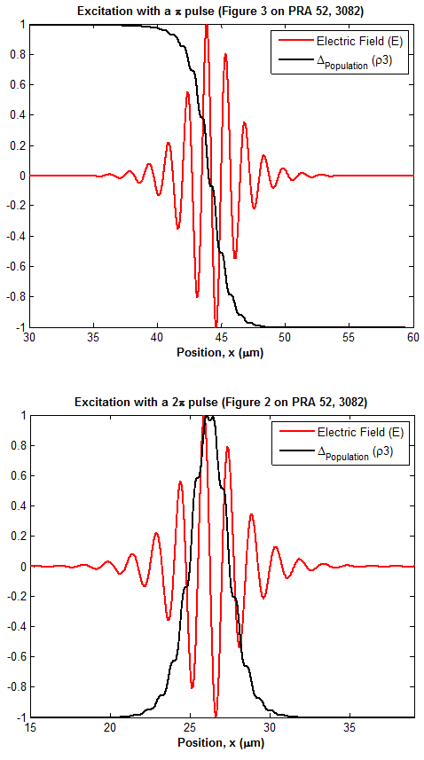

# Distributed Two-Level System

Combining classical electromagnetic equations with the non-classical behavior of a discrete-energy 2-level system enables one to study the spatio-temporal evolution of optical excitations. This is a <a href="http://journals.aps.org/pra/abstract/10.1103/PhysRevA.52.3082" target="_blank">non-classical generalization</a> of the common time-domain electromagnetic simulation method <a href="https://en.wikipedia.org/wiki/Finite-difference_time-domain_method" target="_blank">FDTD</a>.
 
A few typos in the equations have been corrected (by direct derivation of Maxwell-Bloch equations), and the corrected equations have been implemented here.

</img>

